# 夯 — 多团队竞争流水线（Multi-Team Competition Pipeline）

> 基于 gspowers Pipeline 引擎扩展，融入本技能作为团队内部流水线编排。

## 什么是 Pipeline 模式

夯 = 红蓝绿三队并发竞争。每队内部不是散兵游勇，而是 **6 阶段流水线**，阶段间有明确门控和产物交接。三队流水线并行执行，互不阻塞。

---

## 流水线架构

```
                    ┌──────────────┐
                    │  协调者 Phase 1 │  ← 任务拆解 + 假设基线锁定
                    └──────┬───────┘
                           │ 三队共享同一份任务规格
              ┌────────────┼────────────┐
              ▼            ▼            ▼
      ┌────────────┐ ┌────────────┐ ┌────────────┐
      │ 红队 Pipeline │ │ 蓝队 Pipeline │ │ 绿队 Pipeline │
      │ (激进创新)  │ │ (稳健工程)  │ │ (安全保守)  │
      └──────┬─────┘ └──────┬─────┘ └──────┬─────┘
              │              │              │
              └──────────────┼──────────────┘
                             ▼
                    ┌────────────────┐
                    │  Phase 3 裁判评分  │
                    └───────┬────────┘
                            ▼
                    ┌────────────────┐
                    │  Phase 4 汇总融合  │
                    │  (初版)         │
                    └───────┬────────┘
                            ▼
                    ┌────────────────┐
                    │  Phase 5 对抗质疑  │  ← NEW
                    └───────┬────────┘
                            ▼
                    ┌────────────────┐
                    │  Phase 6 回应执行  │  ← NEW
                    └────────────────┘
```

## 团队内部流水线（Team Internal Pipeline）

每个团队自动执行以下阶段流水线。**上游阶段输出自动成为下游阶段输入。禁止跳过。**

```
Pre-Stage  Stage 0    Stage 0.5       Stage 1    Stage 2            Stage 3          Stage 3.5    Stage 4        Stage 5
 物料准备 → 需求对齐 → 测试设计先行 → 架构设计 → TDD微循环       → 集成测试        → 运行时验证 → 代码审查     → 方案汇总
 (协调者)   (前端+后端) (QA测试设计)   (前端+后端) 2a RED→2b GREEN    (QA+覆盖率门控)   (QA专家)     (Code Review)  (前端设计师)
                                     →2c REFACTOR
    │          │           │              │            │                │              │              │              │
    ▼          ▼           ▼              ▼            ▼                ▼              ▼              ▼              ▼
 PRD文档   对齐记录   测试文件+场景矩阵  架构方案   代码+TDD报告     测试+覆盖率报告  运行报告       审查报告       团队方案
```

> **TDD 默认化**：Stage 0.5 是新增的测试设计先行阶段。Stage 2 从自由编码改为 TDD 微循环。
> 通用串行模式：Stage 0 → Stage 0.5 → Stage 1 顺序执行。
> Qoder 并发模式：Stage 0.5 与 Stage 1 可 fan-out 并行（不增加串行耗时）。

### 阶段定义

| 阶段 | 执行者 | 输入 | 产出 | 门控 |
|------|--------|------|------|------|
| Pre-Stage | 协调者 | SDD Excel / 需求描述 | PRD.md | PRD.md 完整通过机械化验证 |
| Stage 0 | 前端+后端 | PRD + 假设基线 | {team}-00-alignment.md | 产出存在即通过 |
| Stage 0.5 | QA 测试设计专家 | PRD/Spec + 对齐记录 | {team}-05-tests/ + {team}-05-scenarios.json + {team}-05-red-report.md | 测试编译成功 + 全部 RED + 覆盖 3 维度 |
| Stage 1 | 前端+后端 | 对齐记录 | {team}-01-architecture.md | 架构方案无歧义 |
| Stage 2 | 前端+后端 | 架构方案 + Stage 0.5 测试 | 代码 + {team}-02-implementation.md + {team}-02-tdd-cycle-*.md | 全部 GREEN + checklist P0(A/B/D/J/K)通过 |
| Stage 3 | QA 专家 | 代码 + 测试 + checklist | {team}-03-test-report.md + 覆盖率报告 | Happy Path 通过 + 分支覆盖≥70% + checklist 专项通过 |
| Stage 3.5 | QA 专家 | 代码 + 测试报告 | {team}-035-runtime-report.md | P0 错误 = 0 |
| Stage 4 | Code Review | 代码 + 测试 + 覆盖率 + 运行报告 | {team}-04-review-report.md | 无 error + checklist 审计通过 + TDD K1/K2/K5 通过 |
| Stage 5 | 前端设计师 | Stage 0-4 所有产物 | {team}-05-final.md | 完整方案结构 |

## 阶段 DAG

```mermaid
graph LR
    PS[Pre-Stage] --> S0[Stage 0 需求对齐]
    S0 --> S05[Stage 0.5 测试设计先行]
    S05 --> IG{反转门控}
    IG -->|零问题/已回答| S1[Stage 1 架构设计]
    IG -->|有问题| Q[向用户提问]
    Q -->|用户回答| S1
    S1 --> S2a[Stage 2a RED 验证]
    S2a --> S2b[Stage 2b GREEN 实现]
    S2b --> S2c[Stage 2c 重构优化]
    S2c -->|还有测试| S2a
    S2c -->|全部 GREEN| S3[Stage 3 集成测试+覆盖率]
    S3 --> S35[Stage 3.5 运行时验证]
    S35 --> S4[Stage 4 代码审查+TDD审计]
    S4 --> S5[Stage 5 方案汇总]
```



> **Qoder 并发分支**：Stage 0.5 与 Stage 1 可 fan-out 并行执行（不增加串行耗时）。
> 此时 DAG 中 S05 → S1 变为 S05 ∥ S1 并行。

**反转门控**（Stage 0 → Stage 0.5 之间）：三队完成 Stage 0 后，协调者收集各队 `[ASSUMPTION:CRITICAL]` 问题，去重合并后向用户展示选择题问卷。用户回答后广播回所有团队。零问题时自动跳过。

## 三队并发模型

| 特性 | 说明 |
|------|------|
| 并行度 | 3 队 × 7 阶段 = 最多 15 个 agent 同时运行（含 QA 测试设计专家） |
| 阻塞模型 | 阶段失败只阻塞该团队，不影响其他团队 |
| 资源隔离 | 各队独立的 prompt 上下文、产物文件、agent 实例 |
| 共享基线 | 三队共享协调者锁定的假设基线，确保方案可比 |
| 缓存优化 | 所有 agent 共享前缀由 `hammer-bridge.cjs prefix` 生成，逐字相同以命中服务器端缓存 |

### 缓存 TTL 时间窗口

DeepSeek prompt cache TTL = **5 分钟**。流水线阶段必须在此窗口内完成，否则后续 agent 失去缓存红利。

| 指标 | 阈值 | 动作 |
|------|------|------|
| 单阶段耗时 | < 2 分钟 | ✅ 安全 — 缓存保持 |
| 单阶段耗时 | 2-3 分钟 | ⚠️ 警告 — 加速推进，减少不必要操作 |
| 单阶段耗时 | > 3 分钟 | 🔴 风险 — 下个 agent 可能缓存失效，重新建立 ~250K token 前缀 |
| 整条流水线 | < 10 分钟 | ✅ 队内 Stage 0-5 串联缓存命中 |
| 跨队间隔 | < 5 分钟 | ✅ 红→蓝→绿 缓存共享 |

**加速策略**：
1. 每个 agent 用 Flash 模型（sonnet）— 输出速度比 Pro 快 2-3x
2. 阶段产物用 lean-ctx 压缩读取（见 SKILL.md "阶段间产物传递"）
3. 搜索/抓取等辅助操作用 `kf-web-search`/`kf-scrapling`/`kf-opencli` 并行执行
4. 不等待用户确认 — recording 模式，阶段间自动推进
5. 避免在 agent 内做大规模全量文件读取 — 用 ctx_read 模式化读取

### Agent 分工

| Agent | 流水线阶段 | 模型 |
|-------|-----------|------|
| 前端+后端专家 | Stage 0-1（对齐→架构） | sonnet (flash) |
| QA 测试设计专家 | Stage 0.5（测试设计先行） | sonnet (flash) |
| 前端+后端专家 | Stage 2（TDD 微循环：2a RED→2b GREEN→2c REFACTOR） | sonnet (flash) |
| QA 专家 | Stage 3-3.5（测试+覆盖率→运行时验证） | sonnet (flash) |
| Code Review | Stage 4（代码审查+TDD 合规审计） | sonnet (flash) |
| 前端设计师 | Stage 5 方案汇总 | sonnet (flash) |
| 协调者（本 Skill） | Pre-Stage + Phase 1-6 | pro |
| 对抗者 | Phase 5 对抗质疑（单一 agent） | pro |
| 汇总者 | Phase 4 初版融合 + Phase 6 回应与执行（可 spawn 子 agent） | pro |

## 任务类型调整

| 任务类型 | Agent 配置 | 流水线策略 |
|----------|-----------|-----------|
| **编码开发** | 3 agent/队 × 3 队 + 裁判 + 汇总 + 对抗者 + QA 测试设计 = 15 | 完整 7 阶段 + TDD 微循环 + 覆盖率门控 + 对抗质疑 |
| **文档生成** | 2 agent/队 × 3 队 + 裁判 + 汇总 + 对抗者 = 9 | 精简 3 阶段（对齐→撰写→审查）+ 对抗质疑 |
| **方案评审** | 2 agent/队 × 3 队 + 裁判 + 汇总 + 对抗者 = 9 | 3 阶段（数据调研→分析→论证）+ 对抗质疑 |

### 方案评审 — 数据调研阶段

方案评审与编码开发/文档生成不同：输入源多样，数据准确性决定评审质量。
**在分析论证之前，必须先完成充分的数据调研。**

| 输入源类型 | 判定条件 | 数据调研工具 | 产出 |
|-----------|---------|-------------|------|
| **指定项目代码** | 用户提供本地路径，含 {IDE_ROOT}/ skills/ rules/ 等 | `kf-code-review-graph` 提取依赖图谱 + `kf-kb-envoy` 摄入知识库 | `{team}-00-research.md` — 代码结构、技能清单、配置规则摘要 |
| **指定文档/附件** | 用户提供 .md/.docx/.pdf/.xlsx 等文件 | `kf-kb-envoy` 摄入理解（raw→wiki 全流程） | `{team}-00-research.md` — 文档摘要、关键数据提取、歧义标注 |
| **指定链接/URL** | 用户提供网址 | `kf-web-search` + `kf-scrapling`（反反爬）+ `kf-opencli`（平台直取） | `{team}-00-research.md` — 网页内容摘要、多源交叉验证 |
| **混合来源** | 同时包含以上多种 | 上述工具并行使用，确保数据充分 | `{team}-00-research.md` — 综合数据报告 |

**调研充分性门控**：
- 涉及网络信息 → 至少 2 个独立来源交叉验证
- 涉及项目代码 → 必须跑通 `kf-code-review-graph` 依赖分析
- 涉及附件文档 → 必须完成 `kf-kb-envoy` ingest 全流程
- 调研产出不完整 → 阻断进入分析阶段，回退补充数据

### 方案评审流水线

```
Stage 0             Stage 1          Stage 2
数据调研       →     分析评估     →    方案论证
(全栈开发)           (全栈开发)        (全栈开发)
    │                    │                 │
    ▼                    ▼                 ▼
调研报告          分析报告          论证方案
(数据充分性门控)    (分析完备性门控)   (论证说服力门控)
```

| 阶段 | 执行者 | 输入 | 产出 | 门控 |
|------|--------|------|------|------|
| Stage 0 数据调研 | 全栈开发 | 用户原始输入（代码/文档/链接） | `{team}-00-research.md` | 数据充分性门控通过 |
| Stage 1 分析评估 | 全栈开发 | 调研报告 | `{team}-01-analysis.md` | 分析维度完整、结论有数据支撑 |
| Stage 2 方案论证 | 全栈开发 | 分析报告 | `{team}-02-argument.md` | 论证逻辑完整、反驳点已预判 |

## 状态追踪

### 团队级状态

| 状态 | 说明 |
|------|------|
| `pending` | 等待执行 |
| `running` | 执行中 |
| `passed` | 通过 |
| `failed` | 失败（阻塞该团队） |
| `skipped` | 跳过（条件触发阶段未满足） |

### 全局阶段

| Phase | 职责 | 状态 |
|-------|------|------|
| Phase 1 | 任务理解与拆解（任务规格 + 假设基线锁定） | 完成 → 进入 Phase 2 |
| Phase 2 | Swarm + Pipeline 并发执行（三队并行） | 全部 Stage 0 完成 → 进入 Phase 2.0 反转门控 |
| Phase 2.0 | 反转门控（收集 CRITICAL 问题 → 问卷 → 用户回答 → 广播） | 门控通过（含零问题跳过）→ 进入 Stage 1 |
| Phase 2续 | Stage 1-5 继续执行 | 全部完成 → 进入 Phase 3 |
| Phase 3 | 裁判评分 | 评分完成 → 进入 Phase 4 |
| Phase 4 | 汇总融合（初版） | 初版方案 → 进入 Phase 5 |
| Phase 5 | 对抗质疑 | 质疑完成 → 进入 Phase 6 |
| Phase 6 | 汇总者回应与执行 | 终版方案输出 |

## 门控验证

### 阶段门控（每阶段完成后）

每个阶段完成后执行机械化验证：

```
node {IDE_ROOT}/helpers/harness-gate-check.cjs \
  --skill kf-multi-team-compete \
  --stage <N> \
  --team <红/蓝/绿> \
  --required-files "{team}-0<N>-*.md" \
  --forbidden-patterns "TODO" "待定"
```

### TDD 门控验证（Stage 0.5 / 2a / 2b / 2 / 3）

```
# Stage 0.5 — 测试设计先行
node {IDE_ROOT}/helpers/tdd-gate-check.cjs --stage 0.5 --team {team}

# Stage 2a — RED 验证
node {IDE_ROOT}/helpers/tdd-gate-check.cjs --stage 2a --team {team}

# Stage 2b — GREEN 实现
node {IDE_ROOT}/helpers/tdd-gate-check.cjs --stage 2b --team {team}

# Stage 2 — 编码完成
node {IDE_ROOT}/helpers/tdd-gate-check.cjs --stage 2 --team {team}

# Stage 3 — 覆盖率门控
node {IDE_ROOT}/helpers/coverage-reporter.cjs gate --team {team} --min-branches 70
```

### 批次间门控（Phase 间）

| 门控 | 检查项 | 失败处理 |
|------|--------|---------|
| Phase 1 → Phase 2 | 任务规格 7 项完整、假设基线已锁定 | 回退 Phase 1 |
| Phase 2 → Phase 2.0 | 三队全部 Stage 0 完成 | 等待未完成团队 |
| Phase 2.0 → Phase 2续 | 反转门控通过（零问题自动跳过 / 用户已回答所有问题） | 等待用户回答 |
| Phase 2续 → Phase 3 | 三队全部 Stage 5 完成 | 等待未完成团队 |
| Phase 3 → Phase 4 | 评分卡完整、排名明确 | 回退评分 |
| Phase 4 → Phase 5 | 初版方案含「待对抗者重点审查的疑点」 | 回退融合 |
| Phase 5 → Phase 6 | 对抗报告含 MUST-FIX 清单 | 回退对抗 |
| Phase 6 完成 | 终版方案含对抗者质疑处理记录 | 回退汇总 |

## 执行流程

```
Phase 1 任务拆解
  └── 任务规格锁定 → 假设基线锁定 → Gate 通过

Phase 2 并发执行 (Stage 0)
  ├── [并行] 红队 Stage 0
  ├── [并行] 蓝队 Stage 0
  └── [并行] 绿队 Stage 0
       │
       └── 三队 Stage 0 全部完成

Phase 2.0 反转门控
  ├── 收集各队 CRITICAL 问题
  ├── 去重合并 → 生成选择题问卷
  ├── 向用户展示问卷
  ├── 用户回答 → 决策广播回所有团队
  └── 零问题时自动跳过

Phase 2续 并发执行 (Stage 1-5)
  ├── [并行] 红队 Pipeline: Stage1→...→Stage5
  ├── [并行] 蓝队 Pipeline: Stage1→...→Stage5
  └── [并行] 绿队 Pipeline: Stage1→...→Stage5
       │
       └── 每队门控: 阶段产物必须完整，否则阻塞该队

Phase 3 裁判评分
  ├── kf-alignment 对齐评分标准
  ├── 红队评分卡
  ├── 蓝队评分卡
  └── 绿队评分卡
       │
       └── Gate: 评分卡+排名完整

Phase 4 汇总融合（初版）
  ├── 择优采纳（冠军领先 >15%）
  ├── 博采众长（冠亚接近 <15%）
  └── 按需融合（三方接近）
       │
       ├── 标注「待对抗者重点审查的疑点」
       └── 进入 Phase 5

Phase 5 对抗质疑
  ├── 8 维度审查（部署/边界/性能/安全/维护/扩展/成本/用户）
  ├── 标记 MUST-FIX（3-5 个必须回应的问题）
  └── 输出对抗报告
       │
       └── 进入 Phase 6

Phase 6 汇总者回应与最终执行
  ├── 逐条回应 MUST-FIX（采纳/部分采纳/驳回）
  ├── 产出终版方案（含对抗处理记录）
  └── 复杂任务：spawn 子 agent 执行
       │
       └── 输出终版方案 + 碾压指标
```

## 输出规范

每次执行完成后输出摘要，包含：

1. 任务描述（一句话）
2. 三团队方案对比表（要点 + 评分 + 流水线阶段）
3. 代码审查图谱（kf-code-review-graph）
4. 对抗者审查（MUST-FIX 处理记录）
5. 最终决策（融合策略 + 对抗闭环确认 + 方案保存路径）
6. 碾压指标（参与 Agent 数、提升比例、覆盖风险维度、对抗者发现的风险）

## 触发词

| 触发词 | 说明 |
|--------|------|
| `夯 [任务]` | 启动完整多团队竞争流水线 |
| `多团队竞争` | 同上 |
| `竞争评审` | 同上 |
| `快速夯` | 跳过流水线，双视角快速对比 |

## 与 gspowers Pipeline 的关系

| 方面 | gspowers Pipeline | 夯 Pipeline |
|------|-------------------|-------------|
| 适用场景 | 单项目多模块顺序开发 | 多团队并发竞争评审 |
| 执行方式 | 批次并行 + 批次串行 | 三队完全并行 + 队内串行 |
| 依赖处理 | DAG 拓扑排序 | 线性阶段 DAG |
| 并发粒度 | 批次内模块并行 | 团队间并行 + 团队内串行 |
| 状态粒度 | 模块级 | 团队 × 阶段级 |
| 门控 | 批次间门控 | 阶段门控 + Phase 门控 |
| 失败影响 | 阻塞后续批次 | 只阻塞该团队 |

