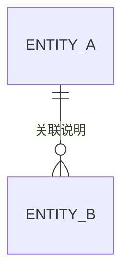

# SDD Excel 解析规则（PRD Generator 专用）

> 供 `prd-generator` Skill 在解析 SDD 需求采集 Excel 时遵循的解析规则和数据提取策略。

---

## 一、输入源识别

当用户提供 `.xlsx` 文件时，按以下条件识别是否为 SDD 模板：

1. 文件包含 `ReadMe` Sheet，且首行包含 `SDD需求采集模板`
2. 包含 `Sheet14-AI指令配置` 或 `Sheet1-项目基础信息`
3. Sheet 命名符合 `SheetN-中文名称` 或 `sheetN-中文名称` 格式（注意 `sheet0` 可能为小写）

> **版本说明**：本规则适配 **SDD 需求采集模板 v7（通用模板）**。v7 版 Sheet 编号与早期版本不同，AI 读取时必须以实际 Sheet 名称为准，不可按编号硬编码。

**识别为 SDD 后**：跳过 Q2-Q7 口述问询，直接进入结构化数据提取流程（见下）。
**未识别为 SDD**：按原有 Phase 1 口述问询流程执行。

---

## 二、Excel 解析通用规则

### 2.1 合并单元格处理
- 内容仅在左上角格子，其余格子为空
- 遇到空单元格时，向左/向上回溯获取分类值
- 回溯策略：优先向左（同行前一列），若左侧也为空则向上（同列前一行）

### 2.2 Checkbox 多选项解析
- `☑` = 推荐默认（已勾选）= 优先采用 / 视为选中
- `☐` = 可选未默认 = 可选项 / 视为未选中
- **提取策略**：
  - 若「选用值」列有内容，以选用值为准（用户实际勾选的结果）
  - 若「选用值」列为空，提取所有 `☑` 项作为选中值
  - 输出为结构化键值对：`{选项文本: true/false}`

### 2.3 单元格内换行解析
- 一个格子里用 `\n` 分隔多行文本
- 每行是一个独立选项，逐行解析
- 示例：`"☑ Vue 3\n☐ React\n☑ 微信小程序"` → `['Vue 3', '微信小程序']`

### 2.4 颜色含义（仅辅助参考）
- 浅绿 = 示例值（已填写）
- 浅黄 = 可选项区
- 白色 = 数据填写区
- **规则**：颜色不改变内容语义，仅用于人工辅助识别

### 2.5 空行跳过
- 部分行可能全为空，是结构占位
- 跳过所有列均为空值（null/undefined/空字符串）的行

### 2.6 示例行识别与跳过
- 以 `"示例："` 开头的行是模板示例，**不纳入实际数据**
- 示例行用于理解列格式，解析时跳过

---

## 三、各 Sheet 数据提取策略

### 3.0 Sheet→PRD 章节映射总表

> 本表汇总所有 SDD Sheet 与 PRD 章节的映射关系，供 AI 在检测到 SDD Excel 时快速定位每个 Sheet 数据应填入 PRD 的哪个章节。

| SDD Sheet | PRD 章节 | 映射说明 |
|-----------|---------|----------|
| sheet0-业务主流程 | 1.3 业务流程概览 | 阶段级宏观概览；Sheet2 是模块级详细步骤，二者互补不重复 |
| Sheet1-项目基础信息 | 1.1 业务目标 + 1.2 目标用户角色 + 8.技术约束 + 11.待确认事项 | 项目背景→业务目标，目标用户→角色表，合规约束/关联系统→技术约束，数据迁移/预算→待确认事项 |
| Sheet2-业务流 | 4.页面交互逻辑 + 5.异常处理方案 | 主路径→交互步骤，异常路径(带字母序号)→异常处理 |
| Sheet3-数据关系 | 3.数据字段定义 | 技术设计内容，仅作 ER 图参考，不强制搬运 |
| Sheet4-状态流转 | 4.页面交互逻辑(状态图) | Mermaid stateDiagram-v2 + 状态-权限映射表 |
| Sheet5-资金流分析 | 9.资金流分析(条件章节) | 仅当涉及资金流转时输出 |
| Sheet6-功能页面表 | 4.页面交互逻辑(页面结构) | 页面清单 + 所属端 + 路由 |
| Sheet7-功能权限表 | 4.页面交互逻辑(权限矩阵) | 角色×页面权限矩阵 |
| Sheet8-业务规则 | 2.业务规则 | BR-xxx 规则清单，IF-THEN 格式 |
| Sheet9-页面交互 | 4.页面交互逻辑(控件细节) | 控件类型、响应反馈、校验规则 |
| Sheet10-非功能需求 | 6.验收标准 + 8.技术约束 | 性能/并发→验收标准，可用性/安全/兼容→技术约束 |
| Sheet11-合规流程表 | 10.合规流程(条件章节) | 仅当涉及合规约束时输出 |
| Sheet12-原型控件 | 7.UI规范约束(内部参考) | 不直接输出到 PRD，仅作为 AI 内部参考 |
| Sheet13-部署配置方案 | 8.技术约束(部署补充) | 方案对比 + 数据库选型 |
| Sheet14-AI指令配置 | 7.UI规范约束 + 8.技术约束 | 技术栈、组件库、部署方式、目标产物 |
| Sheet15-变更历史 | 文档信息(版本参考) | 仅引用最新版本号，不输出完整变更历史 |
| Sheet16-待确认问题清单 | 11.待确认事项 | 确认内容为空的行，按优先级分组 |

---

> **读取顺序**：严格遵循 Readme 中「Sheet推荐阅读顺序（分层递进式）」，按 Layer 0 → Layer 6 顺序读取，避免跨层跳跃。

### 3.0 ReadMe → 解析规则与依赖关系

**提取目标**：获取 AI 读取规则、Sheet 推荐顺序、Sheet 依赖关系

**处理规则**：
1. 读取「一、AI读取规则」确认解析策略（合并单元格、Checkbox、换行、颜色、空行）
2. 读取「二、Sheet推荐阅读顺序」确定读取优先级
3. 读取「三、Sheet依赖关系」确认引用关系（如 Sheet8 引用 Sheet2/3/4）

### 3.1 sheet0-业务主流程 → 需求背景（全局概览）

**提取目标**：PRD 第 1 章「需求背景」中的业务流程概览

**处理规则**：
1. 按「阶段」分组（数据维护阶段 → 申码阶段 → 制码阶段 → ...）
2. 提取每行：序号、阶段、角色、操作端、操作、产生的业务数据
3. 输出业务流程概览文字版，作为项目全局认知的基础

**输出格式**：
```markdown
### 业务主流程概览

| 序号 | 阶段 | 角色 | 操作端 | 操作 | 产生的业务数据 |
|------|------|------|--------|------|--------------|
| 1 | ... | ... | ... | ... | ... |
```

### 3.2 Sheet1-项目基础信息 → 需求背景

**提取目标**：填充 PRD 第 1 章「需求背景」

| 字段 | PRD 子章节 | 提取规则 |
|------|-----------|---------|
| 项目名称 | 文档信息标题 | 直接使用 |
| 项目简称 | — | 备用简称 |
| 行业领域 | 1.1 业务目标 | 提取 `☑` 项 |
| 项目背景 | 1.1 业务目标 | 直接使用「填写值」 |
| 目标用户 | 1.2 目标用户角色 | 直接使用 |
| 核心角色 | 1.2 目标用户角色 | 提取 `☑` 项，转为角色表格 |
| 使用终端 | 1.1 业务目标 / 8.技术约束 | 提取 `☑` 项 |
| 使用场景 | 1.1 业务目标 | 直接使用 |
| 核心业务流程周期 | 8.技术约束 | 提取 `☑` 项 |
| 是否有历史系统 | 1.1 业务目标 | 提取 `☑` 项 |
| 合规约束 | 8.技术约束 | 提取 `☑` 项 |
| 关联外部系统 | 1.1 业务目标 / 8.技术约束 | 直接使用 |
| 数据迁移要求 | 11.待确认事项 | 直接使用 |
| 上线时间要求 | 8.技术约束 / 文档信息 | 直接使用 |
| 预算范围 | 9.待确认事项（如未明确） | 提取 `☑` 项 |

### 3.3 Sheet2-业务流 → 页面交互逻辑 + 异常处理

**提取目标**：填充 PRD 第 4 章「页面交互逻辑」和第 5 章「异常处理方案」

**处理规则**：
1. 按「模块」分组，每个模块一个子章节
2. 主路径步骤（纯数字序号）按顺序排列
3. 异常路径步骤（含字母序号，如 2a）紧跟对应主路径步骤后
4. 每步骤格式化为：`用户操作 → 系统动作 → 结果`
5. SLA/时效填入「备注」列
6. 异常路径自动汇入第 5 章「异常处理方案」

**输出格式**：
```
### 4.X MODULE_NAME

| 步骤 | 用户操作 | 系统响应 | 异常处理 | 时效 |
|------|---------|---------|---------|------|
| 1 | ... | ... | — | ≤2s |
| 2 | ... | ... | 见 2a | ≤3s |
| 2a | — | — | 校验失败提示 | 即时 |
```

### 3.4 Sheet3-数据关系 → 数据字段定义 + ER 图

**提取目标**：PRD 第 3 章「数据字段定义」的 ER 图参考

> **定位**：Sheet3 属于技术设计内容。PRD 生成时可作为背景参考，用于构建 ER 图理解实体关联，但不强制要求输出完整 ER 图。

**处理规则**：
1. 跳过示例行
2. 收集所有实体关系（实体A → 实体B）
3. 提取关联字段、关系类型（1:N/N:1/1:1/N:N）、关联说明
4. 在 PRD 第 3 章末尾输出 Mermaid ER 图（如数据充分）

**输出格式**：
```markdown
### 3.X 数据实体关系

> 实体A → 实体B | 关联字段：A.field ↔ B.field | 关系类型：1:N


```

### 3.5 Sheet4-状态流转 → 状态图

**提取目标**：PRD 第 4 章核心流程状态图

**处理规则**：
1. 每个实体生成一个 Mermaid `stateDiagram-v2`
2. 正常流转路径解析为状态节点和转换边
3. 异常路径/超时处理/回滚条件标注为虚线或备注
4. 输出状态-权限映射表
5. 提取幂等要求标注

### 3.6 Sheet5-资金流分析 → 资金流分析章节

**提取目标**：PRD 第 9 章「资金流分析」（如适用）

**处理规则**：
1. 按「资金场景」分组
2. 每个步骤输出：序号、资金场景、步骤节点、步骤描述、处理主体、资金方向、涉及金额/比例、对接外部系统/接口
3. 标注系统边界（本系统 vs 第三方）
4. 处理主体映射：本系统 / 第三方平台 / 人工操作 / 外部组织

### 3.7 Sheet6-功能页面表 + Sheet7-功能权限表 → 页面交互逻辑

**提取目标**：补充 PRD 第 4 章页面结构和权限矩阵

**处理规则**：
1. 按「所属端」分组（用户端/商户端/运营端）
2. 每个页面输出：页面名称、所属端、所属模块、路由URL、页面类型、各角色权限
3. 页面类型映射：
   - `公开` → 无需登录
   - `登录` → 需登录
   - `登录-商户` → 需入驻商户身份
   - `登录-管理员` → 需管理员身份
   - `登录-超管` → 需超级管理员身份
4. Sheet7 权限矩阵：按角色 × 页面输出 ☑/☐ 权限表

### 3.8 Sheet8-业务规则 → 业务规则章节

**提取目标**：PRD 第 2 章「业务规则」

**处理规则**：
1. 跳过示例行
2. 按规则 ID（BR-xxx）排序
3. 每条规则一行表格
4. 规则描述保持 IF-THEN 格式
5. 优先级映射：P0→必须实现 / P1→重要 / P2→可选
6. 「关联业务流步骤序号」列引用 Sheet2 步骤序号

**输出格式**：
```markdown
| 规则编号 | 规则名称 | 规则描述 | 违反处理 | 前置条件 | 优先级 | 关联步骤 |
|---------|---------|---------|---------|---------|--------|---------|
| BR-001 | ... | IF...THEN... | ... | ... | P0 | Sheet2步骤X |
```

### 3.9 Sheet9-页面交互 → 页面交互逻辑补充

**提取目标**：补充 PRD 第 4 章交互细节

**处理规则**：
1. 按「页面引用（Sheet6序号）」分组
2. 每个交互行为输出：序号、页面引用、触发来源、交互行为描述、控件类型、响应/反馈、校验规则
3. 控件选型参考 Sheet12「原型控件」的推荐

### 3.10 Sheet10-非功能需求 → 验收标准 + 技术约束

**提取目标**：PRD 第 6 章「验收标准」和第 8 章「技术约束」

**处理规则**：
1. 性能/并发类 → 验收标准中的性能验收项
2. 可用性类 → 技术约束中的可用性指标
3. 安全类 → 技术约束中的安全要求
4. 兼容类 → 技术约束中的兼容要求
5. 量化指标必须提取具体数字（如「首屏≤2s（P99）」）

### 3.11 Sheet11-合规流程表 → 合规流程章节

**提取目标**：PRD 第 10 章「合规流程」（如适用）

**处理规则**：
1. 按「维度」分组（资金流/货物流/信息流/票据流）
2. 每个子项输出：维度、子项、核心要素、对应系统模块、数据来源/去向、合规要求、技术实现、备注
3. 输出四流合一矩阵概览

### 3.12 Sheet12-原型控件 → UI规范约束参考

**提取目标**：PRD 第 7 章「UI规范约束」的控件选型参考

**处理规则**：
1. 按「场景」分组（单选/多选/日期/文件上传等）
2. 提取数据量级 → 推荐控件 → 可选控件 → 不推荐控件的映射关系
3. 作为 Sheet9「页面交互」中控件选型的字典参考
4. **不直接输出到 PRD**，仅作为 AI 生成页面交互时的内部参考

### 3.13 Sheet13-部署配置方案 → 技术约束（部署补充）

**提取目标**：PRD 第 8 章「技术约束」中的部署相关补充

**处理规则**：
1. 提取方案对比总览中的关键维度（适用场景、部署周期、成本、弹性能力、合规要求等）
2. 提取数据库选型（如达梦DM8、RDS MySQL 8.0）
3. 如适用，将推荐方案及决策建议纳入技术约束的「部署方式」条目
4. **此 Sheet 为新增 Sheet**，旧版模板中不存在

### 3.14 Sheet14-AI指令配置 → 技术约束 + UI规范

**提取目标**：确定生成产物、技术栈、部署方式

| 配置项 | PRD 映射位置 | 提取规则 |
|--------|-------------|---------|
| 目标产物 | 决定 PRD 章节扩展 | 提取所有 `☑` 项 |
| 前端技术栈 | 8.技术约束 / 7.UI规范 | 提取 `☑` 的技术 |
| UI组件库 | 7.UI规范约束 | 提取 `☑` 或「选用值」 |
| 后端技术栈 | 8.技术约束 | 提取 `☑` 的技术 |
| 数据库 | 8.技术约束 | 提取 `☑` 或「选用值」 |
| 缓存 | 8.技术约束 | 提取 `☑` 项 |
| 消息队列 | 8.技术约束 | 提取 `☑` 项 |
| 部署方式 | 8.技术约束 | 提取 `☑` 项 |
| 命名规范 | 8.技术约束 | 提取选用值 |
| 代码语言 | 8.技术约束 | 提取选用值 |
| 优先生成模块 | 任务排序依据 | 提取模块优先级 |
| 是否有外部依赖 | 8.技术约束 / 1.需求背景 | 提取所有 `☑` 项 |
| 多语言支持 | 8.技术约束 | 提取 `☑` 项 |
| 国际化 | 8.技术约束 | 提取 `☑` 项 |
| 多租户/多组织 | 8.技术约束 / 3.数据字段定义 | 提取 `☑` 项 |

> **注意**：v7 模板中 AI 指令配置从 Sheet0 移至 Sheet14，读取时以实际 Sheet 名称为准。

### 3.15 Sheet15-变更历史 → 文档信息（版本参考）

**提取目标**：PRD 文档信息中的版本历史参考

**处理规则**：
1. 提取最新版本号作为 PRD 版本参考
2. 提取最近 3 条变更摘要作为背景信息
3. **不直接输出完整变更历史到 PRD**，仅在「文档信息」中引用最新版本号
4. **此 Sheet 为新增 Sheet**，旧版模板中不存在

### 3.16 Sheet16-待确认问题清单 → 待确认事项

**提取目标**：PRD 第 11 章「待确认事项」

**处理规则**：
1. 跳过示例行（PQ-xx 示例行）
2. 按优先级分组（🔴高/🟡中/🟢低）
3. 仅提取「确认内容」为空的行（真正待确认的）
4. 输出格式：
```markdown
| 编号 | 主题方向 | 问题描述 | 推荐方案 | 影响 | 状态 |
|------|---------|---------|---------|------|------|
| PQ-01 | ... | ... | ... | ... | 待确认 |
```

> **注意**：v7 模板中待确认问题从 Sheet18 调整为 Sheet16。

---

## 四、业务规则编号规范

### 4.1 规则 ID 格式
- 格式：`BR-xxx`（三位数字，如 BR-001, BR-002）
- 递增规则：按 Sheet8 中自然顺序递增
- 引用方式：其他 Sheet 引用时使用 `BR-xxx` 格式

### 4.2 规则描述格式要求
- 必须使用 IF-THEN 格式
- 条件部分用 AND/OR 连接
- 动作部分明确系统行为
- 示例：`IF 用户领取消费券 THEN 校验单人累计领取额度不超过上限 AND 单券限领次数未超`

---

## 五、字段定义表格化输出规范

### 5.1 字段类型推断规则

| 字段名特征 | 推断类型 | 示例 |
|-----------|---------|------|
| id / _id | Int / BigInt / String(UUID) | user_id → Int |
| name / title | String | product_name → String |
| status / state | Enum / Int | order_status → Enum |
| amount / price / fee | Decimal / Float | pay_amount → Decimal |
| count / num / qty | Int | stock → Int |
| time / at / date | DateTime | created_at → DateTime |
| flag / is_ / has_ | Boolean | is_active → Boolean |
| url / path / link | String | image_url → String |
| json / data / meta | JSON | extra_data → JSON |
| encrypted / cipher | String(Encrypted) | id_card(encrypted) → String(加密存储) |

### 5.2 必填推断规则
- 主键字段（id）→ 是
- 外键字段 → 是
- 状态字段 → 是
- 时间戳字段（created_at/updated_at）→ 是
- 描述/备注类字段 → 否
- 可选配置字段 → 否

### 5.3 校验规则推导
- 手机号 → `正则：^1[3-9]\d{9}$`
- 邮箱 → `正则：标准邮箱格式`
- 金额 → `> 0`
- 状态枚举 → `取值范围：[值1, 值2, ...]`
- 敏感字段 → `加密存储`

---

## 六、质量检查清单

在提取完所有 Sheet 数据后，执行以下检查：

- [ ] Sheet1「项目基础信息」的「填写值」列是否有空值？→ 标注 `[TODO: 待补充]`
- [ ] Sheet8「业务规则」是否有 P0 规则？→ 至少应有 1 条 P0
- [ ] Sheet14「AI指令配置」的目标产物是否至少选了一项？
- [ ] Sheet16「待确认问题清单」是否有未确认项？→ 纳入第 11 章
- [ ] 所有 BR-xxx 规则是否在 PRD 第 2 章完整列出？
- [ ] Sheet3「数据关系」中的实体是否在 PRD 第 3 章有对应 ER 图或字段说明？
- [ ] Sheet2「业务流」中的异常路径（带字母序号）是否已汇入第 5 章「异常处理方案」？
- [ ] Sheet6「功能页面表」与 Sheet7「功能权限表」的页面名称是否一致、无遗漏？
- [ ] Sheet4「状态流转」中涉及的核心实体是否在第 4 章输出 Mermaid 状态图？

