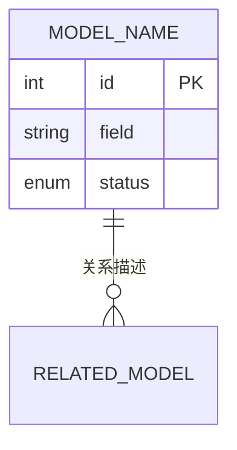

# 数据模型：SPEC_TITLE

> 关联 Spec：[spec.md](./spec.md) vVERSION

---

## 变更总览

### 表操作说明

<!-- 操作枚举：
  - 新增表：全新创建的数据库表
  - 重命名表（业务层）：数据库物理表名不变，API路径和代码中的领域对象名称变更
  - 重命名表（物理层）：数据库表名真实变更，需 ALTER TABLE 或 RENAME TABLE DDL
  - 新增字段：向现有表新增字段
  - 重命名字段：字段名变更（如业务语义重命名）
  - 删除字段：从现有表移除字段
  - 修改字段：字段类型或约束变更
-->

| 操作 | 表名 | 字段 | 类型 | 说明 |
|------|------|------|------|------|
| 新增表 | TABLE_NAME | — | — | _新表用途_ |
| 重命名表（业务层） | OLD_TABLE_NAME | — | — | _数据库表名保留，业务语义重命名为 "NEW_TERM"_ |
| 重命名表（物理层） | OLD_TABLE_NAME → NEW_TABLE_NAME | — | — | _数据库表名真实变更，需 DDL_ |
| 新增字段 | TABLE_NAME | FIELD_NAME | FIELD_TYPE | _字段用途_ |
| 重命名字段 | TABLE_NAME | OLD_FIELD → NEW_FIELD | FIELD_TYPE | _业务语义重命名_ |
| 删除字段 | TABLE_NAME | FIELD_NAME | — | _删除原因_ |
| 修改字段 | TABLE_NAME | FIELD_NAME | NEW_TYPE | _修改原因_ |

---

## Prisma Schema

> 无论后端是否使用 Prisma，此语法作为 AI 理解数据模型的标准中间表示。

```prisma
model MODEL_NAME {
  id        Int      @id @default(autoincrement())
  field     String   @db.VarChar(100)
  status    Status   @default(DRAFT)
  createdAt DateTime @default(now())
  updatedAt DateTime @updatedAt

  // 关系定义
  items     Item[]

  // 索引与表映射
  @@index([field])
  @@map("table_name")
}

enum Status {
  DRAFT
  ACTIVE
  ARCHIVED
}
```

---

## 关系说明

<!-- 可选：使用 Mermaid ER 图描述实体关系 -->



---

## 迁移注意事项

- [ ] 迁移脚本路径：`db/migrations/VXXX__DESCRIPTION.sql`
- [ ] 是否需要数据回填：YES / NO
- [ ] 回滚方案：ROLLBACK_PLAN
