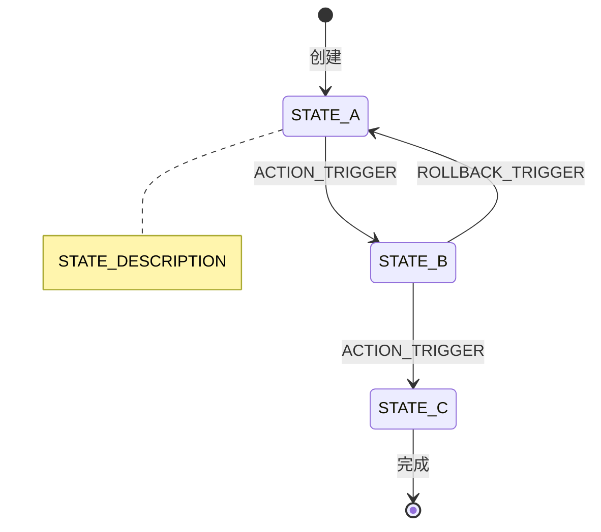

# 状态流转图：SPEC_TITLE

> 关联 Spec：[spec.md](./spec.md) vVERSION

---

## 状态图

---

## 状态-权限映射表

| 状态 | 允许操作 | 允许角色 | 触发条件 | 目标状态 |
|------|---------|---------|---------|---------|
| STATE_A | ACTION_NAME | ROLE_NAME | _触发条件描述_ | STATE_B |
| STATE_B | ACTION_NAME | ROLE_NAME | _触发条件描述_ | STATE_C |

---

## 状态转换规则

1. **STATE_A → STATE_B**：TRANSITION_RULE_DESCRIPTION
2. **STATE_B → STATE_C**：TRANSITION_RULE_DESCRIPTION
3. **STATE_B → STATE_A**（回退）：ROLLBACK_RULE_DESCRIPTION

---

## 异常状态处理

| 异常场景 | 当前状态 | 处理策略 | 最终状态 |
|---------|---------|---------|---------|
| EXCEPTION_SCENARIO | STATE_X | _处理方式_ | STATE_Y |
